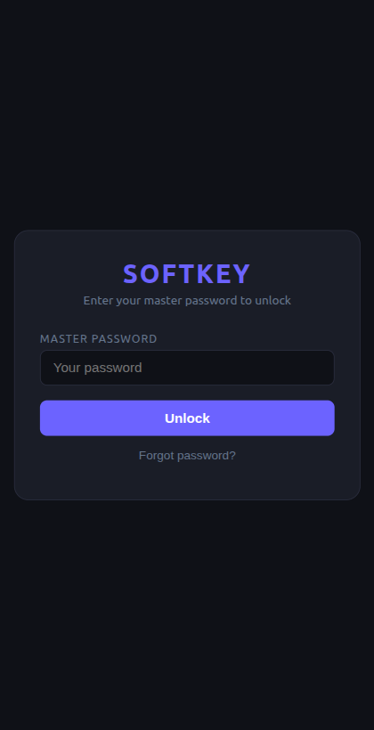
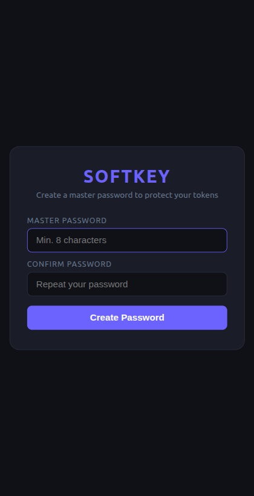
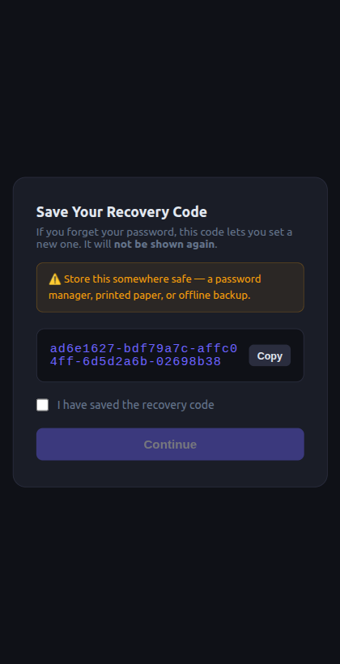
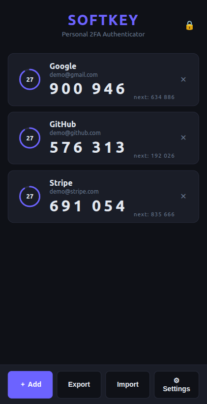
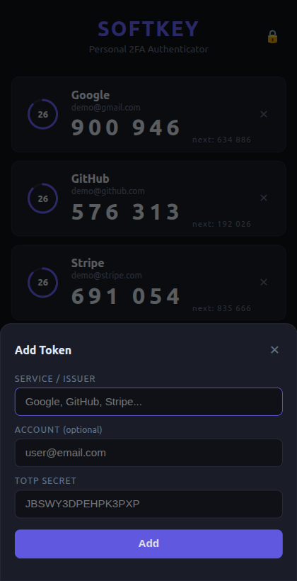
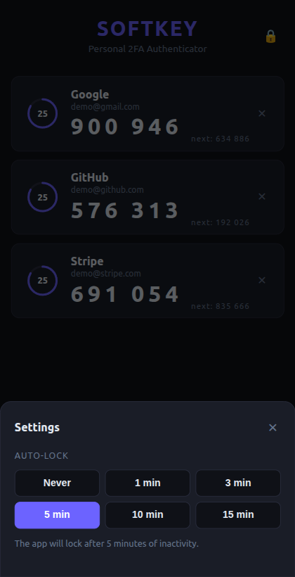

# Softkey

A minimal, self-hosted personal 2FA authenticator that runs locally in your browser. No cloud, no accounts, no phone required.

## Features

- Generate TOTP codes (RFC 6238) for any service
- Visual countdown ring and next-code preview per token
- Click any code to copy it to clipboard
- AES-256-GCM encrypted storage protected by a master password
- Session persistence — stay logged in across server restarts (30-day sessions)
- Account recovery via one-time recovery code
- Export tokens as standard `otpauth://` URIs (compatible with Google Authenticator, Proton Pass, Aegis, Authy, etc.)
- Import tokens from any app that exports `otpauth://` URIs
- Auto-lock after configurable inactivity period (1, 3, 5, 10, or 15 minutes)
- Runs entirely on your machine — secrets never leave it

## Screenshots

<table>
  <tr>
    <td align="center"><br/><sub>Login</sub></td>
    <td align="center"><br/><sub>First-time setup</sub></td>
    <td align="center"><br/><sub>Recovery code</sub></td>
  </tr>
  <tr>
    <td align="center"><br/><sub>Token list</sub></td>
    <td align="center"><br/><sub>Add token</sub></td>
    <td align="center"><br/><sub>Settings / Auto-lock</sub></td>
  </tr>
</table>

## Requirements

- Node.js 18+ **or** Docker

## Setup

### With Docker (recommended)

```bash
docker compose up -d
```

Data files (`auth.json`, `secrets.json`, `session.json`) are stored in `./data/` on the host and persist across restarts.

**To update after a `git pull`:**

```bash
docker compose up -d --build
```

### Without Docker

```bash
npm install
node main.js
```

Then open [http://localhost:3333](http://localhost:3333) in your browser.

On first launch you will be prompted to create a master password. Save the recovery code shown — it is the only way to regain access if you forget your password.

## Security model

| File | Contents |
|------|----------|
| `auth.json` | Master key encrypted twice: once with your password (PBKDF2 + AES-256-GCM), once with the recovery code |
| `secrets.json` | All TOTP secrets encrypted with the master key (AES-256-GCM) |
| `session.json` | Session tokens stored as SHA-256 hashes; the master key is encrypted with each token |

The master key exists in RAM only while the app is unlocked. Locking the app clears it.

## Adding a token

1. Tap **+ Add** at the bottom
2. Enter a name (e.g. `GitHub`) and your TOTP secret
3. Tap **Add** — the code appears immediately

## Export / Import

**Export** — tap **Export** to download a `.txt` file with one `otpauth://totp/` URI per line. This file can be imported by any standard TOTP app.

**Import** — tap **Import**, then paste URIs or load a file exported from another app. Choose **Merge** to add new entries (duplicates are skipped by secret value) or **Replace all** to overwrite your current list.

## Auto-lock

Open **⚙ Settings** and choose an inactivity timeout: 1, 3, 5, 10, or 15 minutes (default: 5 min). The app locks itself automatically when there is no mouse, keyboard, or touch activity within that window. Set to **Never** to disable.

## Project structure

```
main.js        Express server + REST API
index.html     Frontend (single file, no build step)
auth.json      Encrypted master key (git-ignored)
secrets.json   Encrypted TOTP secrets (git-ignored)
session.json   Active sessions (git-ignored)
```

## API

| Method | Endpoint | Description |
|--------|----------|-------------|
| GET | `/api/auth/status` | Returns `{ setup, authenticated }` |
| POST | `/api/auth/setup` | First-time setup `{ password }` — returns `{ recoveryCode, sessionToken }` |
| POST | `/api/auth/login` | Login `{ password }` — returns `{ sessionToken }` |
| POST | `/api/auth/resume` | Resume session `{ sessionToken }` |
| POST | `/api/auth/recover` | Reset password `{ recoveryCode, newPassword }` |
| POST | `/api/auth/logout` | Logout and clear session `{ sessionToken }` |
| GET | `/api/tokens` | Returns all tokens with current codes and time remaining |
| POST | `/api/secrets` | Add a new secret `{ name, secret }` |
| DELETE | `/api/secrets/:id` | Remove a secret by id |
| GET | `/api/export` | Download secrets as `otpauth://` URIs (plain text) |
| POST | `/api/import` | Import `otpauth://` URIs `{ content, mode: "merge"\|"replace" }` |
