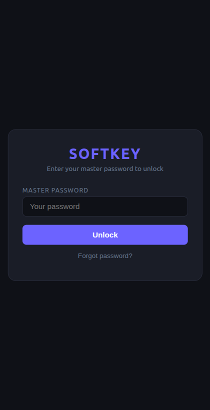
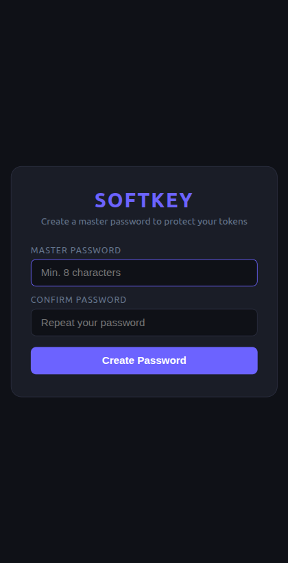
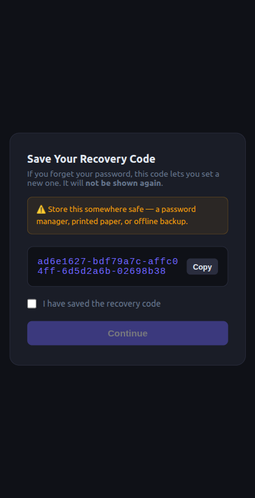
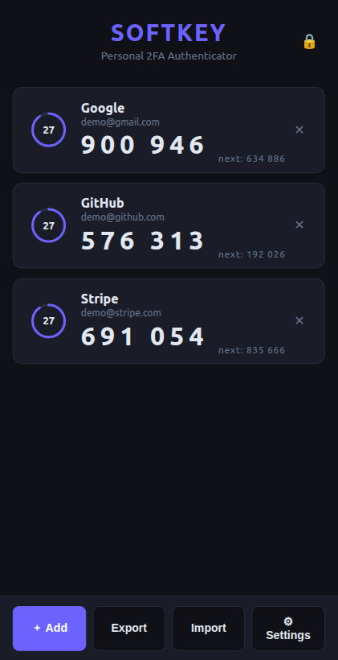
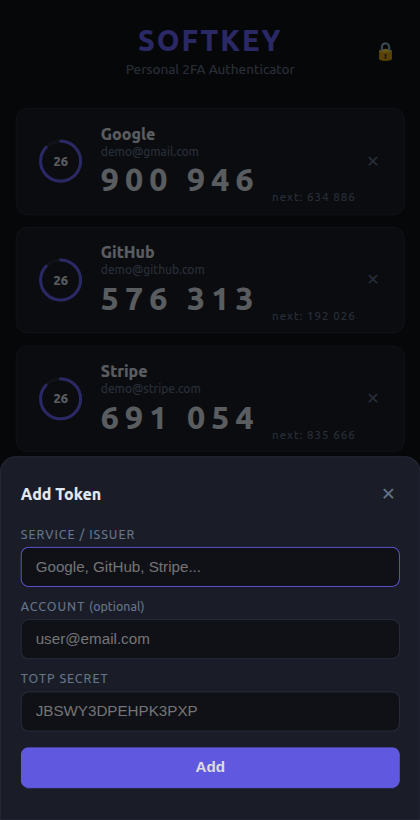
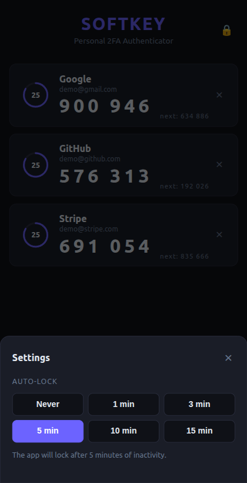

# Softkey

A self-hosted TOTP authenticator that runs in your browser. No phone, no cloud, no account — your 2FA codes live on your own machine, encrypted, and open from any tab.

<table>
  <tr>
    <td align="center"><br/><sub>Login</sub></td>
    <td align="center"><br/><sub>First-time setup</sub></td>
    <td align="center"><br/><sub>Recovery code</sub></td>
  </tr>
  <tr>
    <td align="center"><br/><sub>Token list</sub></td>
    <td align="center"><br/><sub>Add token</sub></td>
    <td align="center"><br/><sub>Settings / Auto-lock</sub></td>
  </tr>
</table>

## Features

- **TOTP codes** (RFC 6238) with a countdown ring and a preview of the next code. Click a code to copy it.
- **Encrypted vault** — AES-256-GCM, unlocked with a master password.
- **Recovery code** — shown once at setup; it's the only way back in if you forget the password.
- **Locks itself** — when you close the tab, and after a configurable time without activity.
- **Import / export** as standard `otpauth://` URIs: Google Authenticator, Aegis, Authy, Proton Pass (including its JSON export).
- **Non-standard tokens** — imported tokens with 8 digits or a 60-second period keep working.
- **No build step, three dependencies.** The codebase is small enough to read in an hour.

## Quick start

### Docker

```bash
git clone https://github.com/Alex93IDE/SoftKey.git
cd SoftKey
docker compose up -d
```

Your data goes to `./data` next to `docker-compose.yml`.

### Node

Requires Node 20+.

```bash
git clone https://github.com/Alex93IDE/SoftKey.git
cd SoftKey
npm install
npm start
```

Open [http://localhost:3333](http://localhost:3333). On first launch you create a master password and get a recovery code — **save the recovery code somewhere safe**.

## Configuration

| variable | default | |
|---|---|---|
| `PORT` | `3333` | port the server listens on |
| `DATA_DIR` | the project folder | where the vault files are written |

## How it works

At setup Softkey creates a random master key. That key encrypts your TOTP secrets, and is stored twice: once encrypted with your password, once with the recovery code (both through PBKDF2-SHA256, 300,000 iterations). Your password and the master key are never written to disk in the clear.

Each unlocked tab gets its own session token, kept in `sessionStorage`, and every request carries it. The server decrypts the master key from that session for that request only, so nothing stays unlocked in memory. Closing the tab drops the token, which locks the vault.

| file in `DATA_DIR` | contents |
|---|---|
| `auth.json` | master key encrypted with the password, and again with the recovery code |
| `secrets.json` | your TOTP secrets, encrypted with the master key |
| `session.json` | open sessions: a hash of each token and the master key encrypted with it |

No telemetry, no outbound network calls, no sync service.

## Backup

Copy `auth.json` and `secrets.json`. They are useless without your password or recovery code, so keep those separately. `session.json` is not needed.

You can also **Export** a plain `otpauth://` list to move to another app — that file is **not encrypted**. Store it carefully and delete it when you're done.

## Security

- **Keep it on your machine or your LAN.** The server speaks plain HTTP, so the password crosses the network in the clear. To reach it from other devices, put it behind a reverse proxy with HTTPS (Caddy, nginx, Traefik) or a VPN.
- **Local only:** to accept connections only from the same computer, change the port mapping in `docker-compose.yml` to `"127.0.0.1:3333:3333"`.
- **Login and recovery are rate-limited** to 5 attempts per 10 minutes per IP.
- **Whoever owns the server owns the codes.** Softkey protects the vault at rest and from other people on the network, not from someone with root on the host while you're unlocked.

Found a vulnerability? Please open a private [security advisory](https://github.com/Alex93IDE/SoftKey/security/advisories/new) rather than a public issue.

## Updating

```bash
git pull
docker compose up -d --build   # or: npm install && npm start
```

Your vault in `DATA_DIR` is kept. The version and server start time are shown under the login card and in Settings (`v1.1.0 · 202610041930`): compare them before and after to confirm the update went in.

## Project status

A personal project in daily use. Versions follow [SemVer](https://semver.org); changes for each version are in [Releases](https://github.com/Alex93IDE/SoftKey/releases).

Bug reports and ideas are welcome in [Issues](https://github.com/Alex93IDE/SoftKey/issues). Pull requests too — for anything bigger than a fix, open an issue first.

If Softkey is useful to you, a star helps, and you can [sponsor development](https://github.com/sponsors/Alex93IDE).

## License

MIT — see [LICENSE](LICENSE).
